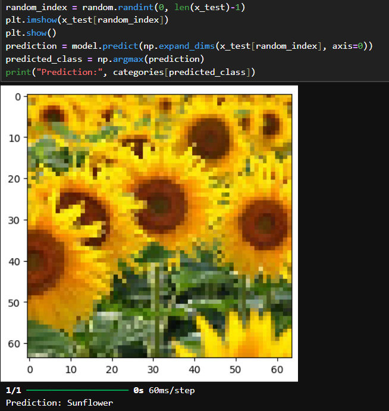
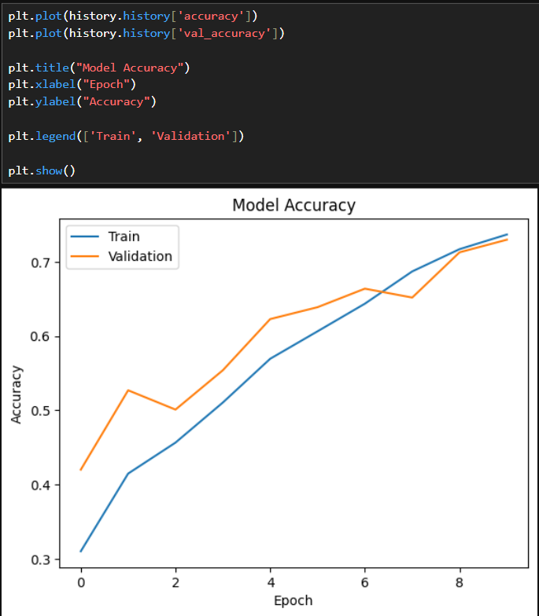
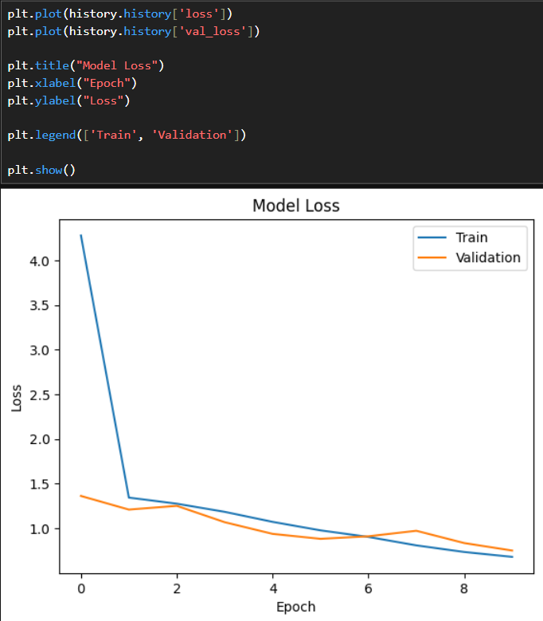

# CNN Image Classification using Deep Learning

## 📌 Project Overview

This project implements a Convolutional Neural Network (CNN) for image classification using TensorFlow/Keras.

The model performs image preprocessing, feature extraction, training, and classification of images into multiple categories.

## 🚀 Technologies Used

* Python
* TensorFlow / Keras
* OpenCV
* NumPy
* Matplotlib

## 📂 Project Modules

* Data Collection
* Image Preprocessing
* CNN Model Building
* Model Training
* Prediction
* Evaluation

## 🧠 CNN Architecture

* Convolution Layer
* MaxPooling Layer
* Flatten Layer
* Dense Layer
* Dropout Layer
* Softmax Output Layer

## Dataset
Dataset Link:
[https://www.kaggle.com/datasets/salader/dogs-vs-cats](https://www.kaggle.com/datasets/kausthubkannan/5-flower-types-classification-dataset/data)

## 📊 Output

## 🔥 Skills Demonstrated

* Deep Learning
* CNN
* Computer Vision
* Image Processing
* TensorFlow/Keras
* Data Preprocessing
